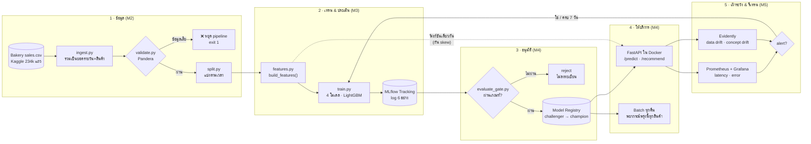
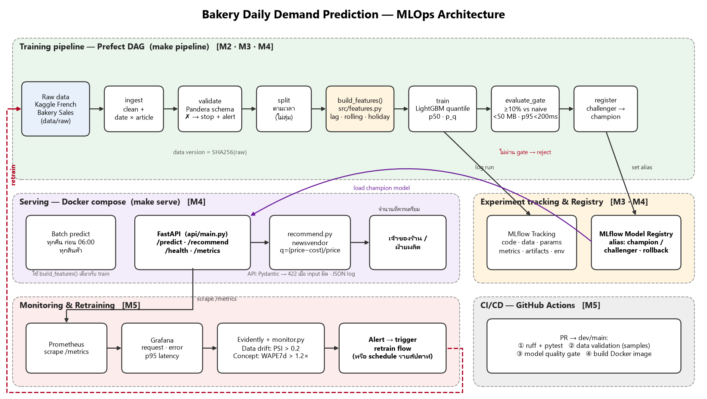

# Bakery Daily Demand Prediction — CP413008 MLOps Project

[](https://github.com/fxlmholy/MLops/actions/workflows/ci.yml)

พยากรณ์ยอดขายรายสินค้าของวันพรุ่งนี้ และแนะนำจำนวนที่ควรเตรียม (Newsvendor) สำหรับร้านเบเกอรี่

> คู่มือทีม: [`CLAUDE.md`](CLAUDE.md) · รายงาน: [`report.md`](report.md)

## 📊 Dashboard ภาพรวม

| WAPE (champion) | ดีกว่า rule เดิม | p95 latency | Throughput | Error rate | Champion |
|:---:|:---:|:---:|:---:|:---:|:---:|
| **0.192** | **−33%** | **19 ms** <br><sub>เป้า &lt; 200 ms</sub> | **155 req/s** <br><sub>50 users</sub> | **0%** | **v1** <br><sub>LightGBM · 0.26 MB</sub> |

| โมเดล (validation) | WAPE | ผ่าน gate? |
|---|:---:|:---:|
| Seasonal-naive (rule เดิม) | 0.288 | baseline |
| Linear Regression | 0.223 | ✅ (แพ้ champion → challenger) |
| LightGBM tuned + holiday | 0.197 | ✅ |
| **LightGBM default** | **0.192** | ✅ **champion v1** |

> Gate: WAPE ดีกว่า seasonal-naive ≥ 10% · โมเดล < 50 MB · p95 < 200 ms · ข้อมูลผ่าน schema — รายละเอียด report §4–§6

## 🏗️ MLOps Architecture



| ขั้น | ทำอะไร | เครื่องมือ | ผู้รับผิดชอบ |
|---|---|---|:---:|
| ข้อมูล | ทำความสะอาด รวมยอดรายวัน แบ่ง train/val/test ตามเวลา | pandas | M2 |
| ตรวจสอบ | schema, qty ≥ 0, สินค้าที่รู้จัก, วันไม่หาย → ข้อมูลเสียหยุดทันที | Pandera | M2 |
| เทรน | lag / rolling / วันหยุด · ทดลอง 4 โมเดล | LightGBM, scikit-learn | M3 |
| ประเมิน | log code, data, params, metrics, artifacts, env | MLflow Tracking | M3 |
| อนุมัติ | gate → challenger → champion · rollback คำสั่งเดียว | MLflow Registry | M4 |
| ให้บริการ | API real-time + batch ทุกคืน · 422 กับ input ผิด | FastAPI, Docker | M4 |
| เฝ้าระวัง | PSI > 0.2 (data drift) · WAPE 7 วัน > 1.2× (concept drift) · p95 / error | Evidently, Prometheus, Grafana | M5 |
| รีเทรน | ทุก 7 วัน หรือเมื่อมี alert → ผ่าน gate อีกรอบ | Prefect, GitHub Actions | M5 |

<details>
<summary>แผนภาพสถาปัตยกรรมแบบเต็ม (รูป)</summary>



</details>

## สิ่งที่ต้องมีในเครื่อง
| เครื่องมือ | เวอร์ชัน | ใช้ทำอะไร |
|---|---|---|
| Git | ล่าสุด | clone repo |
| Anaconda / Miniconda | ล่าสุด | สร้าง env Python 3.11 |
| Docker Desktop | ล่าสุด (เปิดไว้ก่อนรัน) | MLflow, API, Prometheus, Grafana |
| make (ไม่บังคับ) | — | Windows: `choco install make` หรือรันคำสั่งในตารางด้านล่างตรง ๆ |

## รันจากเครื่องเปล่า
```bash
# 0) clone + สร้าง environment
git clone https://github.com/fxlmholy/MLops.git && cd MLops
conda create -n bakery python=3.11 -y && conda activate bakery
pip install -r requirements.txt

# 1) ดาวน์โหลด Kaggle "French Bakery Daily Sales"
#    วางไฟล์ไว้ที่ data/raw/Bakery sales.csv (ชื่อไฟล์ต้องตรง — ดู configs/config.yaml → paths.raw)

# 2) เปิด service (MLflow :5000, API :8000, Prometheus :9090, Grafana :3000)
#    ครั้งแรก build image ~10 นาที · API จะขึ้นสถานะ degraded จนกว่าจะมีโมเดล champion (ปกติ)
docker compose up -d --build

# 3) รัน pipeline ทั้งสายด้วยคำสั่งเดียว (Prefect DAG):
#    ingest → validate → split → train (4 โมเดล + MLflow) → evaluate_gate → register → batch predict → reload API
#    (ต้องเปิด MLflow ก่อน = ขั้นที่ 2)
make pipeline                 # หรือ: python -m src.flow
#    ถ้าไม่มี make ใช้ python -m src.flow ได้เลย

#    สาธิตข้อมูลเสีย: flow หยุดที่ validate (exit code 1) ไม่ train ต่อ
python -m src.flow --data data/samples/bad_sales.csv

# 4) ทดสอบ API (flow ข้างบนสั่ง reload ให้แล้ว — ถ้า API ยังไม่เห็นโมเดลให้สั่งเอง)
curl -X POST http://localhost:8000/reload
curl http://localhost:8000/health
curl -X POST http://localhost:8000/recommend -H "Content-Type: application/json" \
  -d '{"article":"TRADITIONAL BAGUETTE","date":"2022-09-15","on_hand":10,"unit_price":1.2,"unit_cost":0.4}'
```

> **Windows PowerShell:** ใช้ `curl.exe` แทน `curl` หรือเปิด http://localhost:8000/docs แล้วกด "Try it out"
> **ข้อควรระวัง:** ถ้ารัน MLflow server นอก docker แล้ว error `FallbackAsyncAdaptedQueuePool` ให้ `pip install sqlalchemy==2.0.36` (ดู report §5)

## คำสั่งที่ใช้บ่อย
| คำสั่ง | ถ้าไม่มี make ให้รัน | ทำอะไร |
|---|---|---|
| `make pipeline` | `python -m src.flow` | รันทั้ง DAG raw → serving |
| `make serve` | `docker compose up -d --build` | เปิดทุก service |
| `make test` | `ruff check . && pytest -q` | lint + test |
| `make loadtest` | ดู `Makefile` (Windows ใช้ `--host http://127.0.0.1:8000`) | วัด p50/p95 latency + RPS |
| `make drift` | `python -m src.simulate_drift && python -m src.monitor` | สาธิต data drift / concept drift + เกณฑ์แจ้งเตือน (รายละเอียดใน report §7) |
| `make rollback` | `python -m src.registry rollback` แล้ว `curl -X POST localhost:8000/reload` | ย้าย `champion` กลับเวอร์ชันก่อน |
| — | `python -m src.registry status` | ดูเวอร์ชัน / alias ทั้งหมด |
| — | `python -m api.model_service` | batch พยากรณ์พรุ่งนี้ทุกสินค้า → `data/processed/predictions/` |
| `make down` | `docker compose down` | ปิดทุก service |

## สาธิตข้อมูลเสีย
```bash
python -m src.validate data/samples/bad_sales.csv 
```

| Service | URL |
|---|---|
| API docs (Swagger) | http://localhost:8000/docs |
| MLflow | http://localhost:5000 |
| Prefect UI | http://localhost:4200 (เปิดด้วย `prefect server start` ใน terminal แยก) |
| Prometheus | http://localhost:9090 |
| Grafana | http://localhost:3000 (user/pass เริ่มต้น `admin` / `admin`) |

## โครงสร้าง repo
| โฟลเดอร์ | เนื้อหา |
|---|---|
| `src/` | pipeline: ingest, validate, split, features, train, gate, registry, monitor, flow |
| `api/` | FastAPI `/predict` `/recommend` `/health` `/metrics` |
| `configs/config.yaml` | ค่าทั้งหมด: path, split, metrics, gate, SLO, monitoring |
| `monitoring/` | Prometheus + Grafana dashboard |
| `tests/` | pytest |
| `docs/` | AI Project Canvas, architecture, หลักฐาน (`evidence/`) |

> สถานะ README: ร่างจากโครงสร้างที่ออกแบบไว้ — **ยังต้องให้สมาชิก 1 คน clone ใหม่บนเครื่องที่ไม่เคยรันแล้วทดสอบจริง** หลังทุก phase merge เข้า `dev` (ผลบันทึกใน report.md §10)
