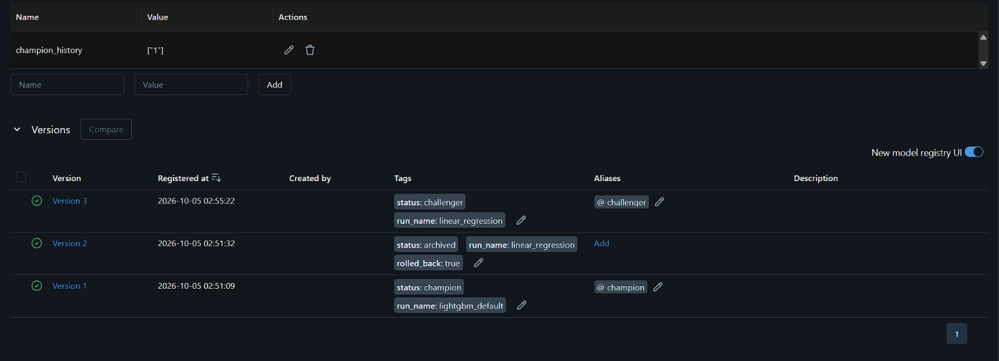
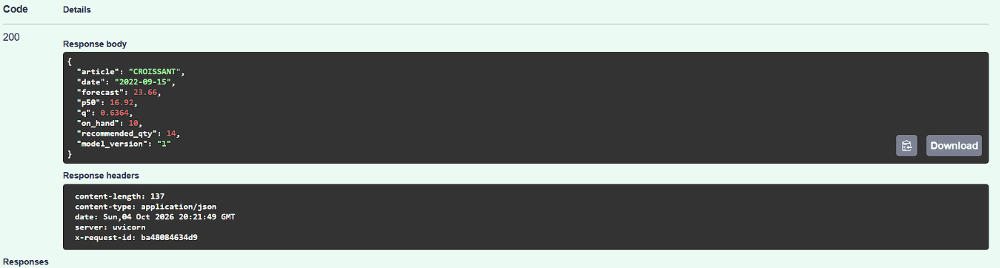
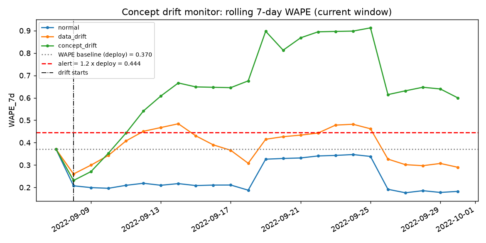
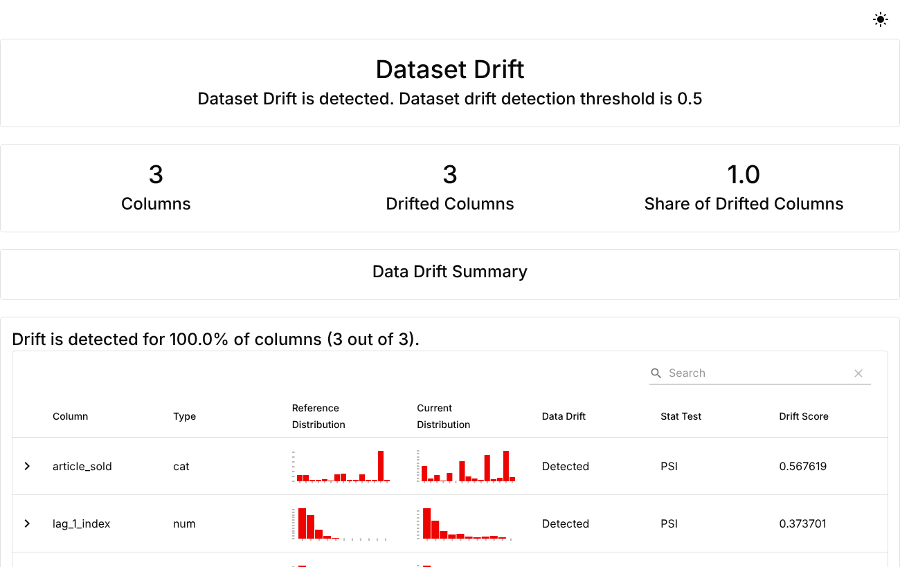
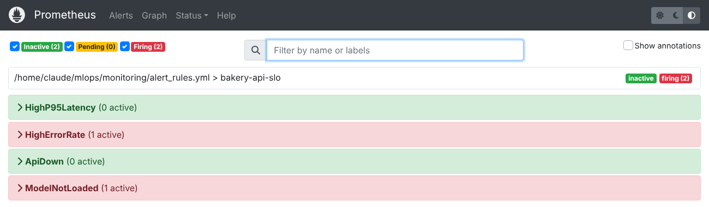

# รายงานโครงงาน CP413008 — Bakery Daily Demand Prediction

> **กฎ:** แต่ละขั้นเขียนเฉพาะ section ของตัวเอง ภายใน PR ของขั้นนั้น (ดู CLAUDE.md §1 และ §7)
> สถานะ: ⬜ ยังไม่เริ่ม · 🟨 กำลังทำ · ✅ เสร็จ

| § | ขั้น | ผู้รับผิดชอบ | สถานะ |
|---|---|---|---|
| 0 | สมาชิกและการแบ่งงาน | M1 + ทุกคน | ⬜ |
| 1 | Problem Framing & AI Project Canvas | M1 | ✅ |
| 2 | Data Ingestion, Split & Validation | M2 | ✅ |
| 3 | Feature Engineering | M3 | ⬜ |
| 4 | Model Development & Experiment Tracking | M3 | ⬜ |
| 5 | Model Registry, Gate & Rollback | M4 | ✅ |
| 6 | Serving, Infrastructure & Load Test | M4 | ✅ |
| 7 | Monitoring, Drift & Retraining | M5 | 🟨 |
| 8 | Pipeline DAG | M2 | ⬜ |
| 9 | CI/CD | M5 | 🟨 |
| 10 | Architecture, Reproducibility & สรุป | M1 | ⬜ |
| 11 | สรุปการใช้ AI (รวมจากทุก section) | M1 | ⬜ |

---

## §0 สมาชิกและการแบ่งงาน
<!-- P0: ทุกคนเพิ่มแถวของตัวเองผ่าน PR ของตัวเอง -->

| รหัส | ชื่อ-สกุล | รหัสนักศึกษา | GitHub | บทบาท |
|---|---|---|---|---|
| M1 | | 67xxxxxxxx | @nattapongsric-collab | Project Lead / Framing / Report |
| M2 | | 67xxxxxxxx | NongPP235 | Data Engineer |
| M3 | | | | ML Engineer |
| M4 | จิตติพัฒน์ มูลศรี | 673380437-5 | @fxlmholy | Serving Engineer |
| M5 | ธนโชติ กมลเลิศ|673380630-1 |thanachotkam-hue | Ops Engineer |

---

## §1 Problem Framing & AI Project Canvas
**ผู้รับผิดชอบ:** M1 (@nattapongsric-collab) · **Reviewer:** M5 (@thanachotkam-hue) · **PR:** #2 · **วันที่เสร็จ:** 2026-10-04

### สิ่งที่ทำ
- เขียน AI Project Canvas ครบทุกช่อง → [`docs/ai_project_canvas.md`](docs/ai_project_canvas.md)
- ตอบ 5 คำถามตรวจสอบหัวข้อ (ใครเดือดร้อน / business metric / drift / latency / rollback) และเหตุผลที่ใช้ ML แทน rule (ใน canvas)
- กำหนด metrics, gating และ SLO ใน [`configs/config.yaml`](configs/config.yaml) (หัวข้อ `metrics`, `gate`, `slo`)

**โจทย์:** พยากรณ์ยอดขายรายสินค้าของวันพรุ่งนี้ (p50 และ p_q) แล้วแนะนำจำนวนที่ควรเตรียม ให้ร้านเบเกอรี่ลดทั้งของขาดและของเหลือทิ้ง

### การตัดสินใจและเหตุผล
- **Quantile regression แทนการทำนายค่าเฉลี่ย** — ความเสียหายของการเตรียมขาดกับเตรียมเกินไม่เท่ากัน จึงทำนาย quantile q = (ราคา − ต้นทุน)/ราคา ตามหลัก newsvendor ซึ่งให้จำนวนเตรียมที่คาดว่ากำไรสูงสุด
- **WAPE เป็น optimizing metric** (เทียบกับ MAPE/RMSE) — WAPE = Σ|y−ŷ| / Σy อ่านเป็น % ได้ง่ายสำหรับเจ้าของร้าน และไม่หารด้วยศูนย์ในวันที่บางสินค้าขายได้ 0 ชิ้น ซึ่ง MAPE ใช้ไม่ได้ ส่วน RMSE ถูกดึงด้วยสินค้าขายดีมากเกินไป
- **Pinball loss @ q เป็น metric รอง** — วัดคุณภาพของ quantile ที่ใช้ตัดสินใจจริง
- **Baseline = seasonal-naive (lag 7)** — คือวิธีที่ร้านใช้อยู่จริง ("เท่าวันเดียวกันสัปดาห์ก่อน") ถ้า ML ชนะไม่ถึง 10% ไม่คุ้มที่จะดูแลระบบที่ซับซ้อนกว่า
- **Serving แบบ Batch + Real-time** — batch ทุกคืนให้ทันก่อนอบตอนเช้า (deadline 06:00) และ API สำหรับถามรายสินค้าระหว่างวัน

| ประเภท | ตัวชี้วัด | เกณฑ์ | อยู่ใน config |
|---|---|---|---|
| Optimizing | WAPE | ต่ำสุด | `metrics.optimizing` |
| Secondary | Pinball loss @ q, MAE | รายงาน | `metrics.secondary` |
| Gating | WAPE ดีกว่า seasonal-naive | ≥ 10% | `gate.min_improvement_vs_naive` |
| Gating | ขนาดโมเดล | < 50 MB | `gate.max_model_size_mb` |
| Gating | p95 latency | < 200 ms | `gate.max_p95_latency_ms` |
| Gating | ข้อมูลผ่าน schema | ต้องผ่าน | `gate.require_schema_pass` |
| Business | stockout rate, waste rate, lost profit/วัน | simulate บน test set (P3) | `metrics.business` |
| SLO | availability / p95 / error rate | ≥ 99% / < 200 ms / < 1% | `slo.*` |
| SLO | batch เสร็จก่อน | 06:00 | `slo.batch_deadline` |

### ผลลัพธ์ / หลักฐาน
- Canvas ครบทุกช่อง ไม่มี TODO เหลือ: `docs/ai_project_canvas.md`
- ค่า metric/gate/SLO ทั้งหมดอยู่ใน `configs/config.yaml` ที่เดียว ให้ `evaluate_gate.py` (M4) และ monitoring (M5) อ่านใช้
- ตัวเลขผลจริง (WAPE ของ baseline เทียบโมเดล และ business metrics) จะมาจากการทดลองใน §3–§4 (M3)

### ปัญหาที่เจอและวิธีแก้
- ขนมปังสดขายข้ามวันไม่ได้ ถ้าใช้ค่าเฉลี่ยจะเตรียมขาดประมาณครึ่งหนึ่งของวัน → แก้ด้วยการทำนาย quantile และคำนวณจำนวนเตรียมแบบ newsvendor
- เพิ่ม key ใหม่ใน `config.yaml` โดย **ไม่แก้ key เดิม** ที่โมดูลของคนอื่นใช้อยู่ (`gate.min_improvement_vs_naive`, `gate.max_model_size_mb`, `slo.*`) เพื่อไม่ให้โค้ดของสมาชิกคนอื่นพัง

### การใช้ AI
- ใช้ Claude Code ช่วยร่างคำตอบ 5 คำถาม, เหตุผลการเลือก metric และจัดรูปแบบตาราง; ตรวจสอบโดย M1 อ่านทุกข้อให้ตรงกับโจทย์และ CLAUDE.md §5 (P1) และเทียบค่าใน config กับเกณฑ์ที่ทีมตกลง

### วิธีรัน/ทดสอบส่วนนี้
```bash
# ตรวจว่า config โหลดได้และมีค่าของ P1
python -c "from src.config import load_config as l; c=l(); print(c['metrics'], c['gate'], c['slo'])"
pytest -q tests/test_smoke.py
```

---

## §2 Data Ingestion, Split & Validation
**ผู้รับผิดชอบ:** M2 (@NongPP235) · **Reviewer:** M1 (@nattapongsric-collab) · **PR:** #6 · **วันที่เสร็จ:** 2026-10-04

### สิ่งที่ทำ
- `src/ingest.py` — อ่าน csv ดิบระดับ transaction → ทำความสะอาด → รวมเป็นตาราง `date × article × qty`
  - แปลงราคา `"0,90 €"` → `0.90` (`parse_price`)
  - ตัดแถวที่ date/qty อ่านไม่ได้, article ว่างหรือเป็น `"."`, และ `qty <= 0` (การคืนของ/ยกเลิกบิล)
  - เลือกสินค้าขายดี top-N (`data.top_n_items = 15`) แล้วสร้างตารางครบทุกวัน × ทุกสินค้า เติม 0 ในวันที่ไม่มีขาย
  - cap ยอดที่เกิน Q99.9 ของสินค้านั้น (`data.outlier_quantile`)
  - บันทึก `data/processed/daily_sales.parquet` + `data/processed/meta.json` (data version = SHA256 ของไฟล์ดิบ, รายชื่อสินค้า, สถิติ mean/std/max ของช่วง train)
- `src/split.py` — `split_from_config()` แบ่ง train/val/test **ตามเวลา** ด้วยวันที่ใน config และ error ถ้ามีชุดไหนว่าง
- `src/validate.py` — Pandera schema ตรวจ 6 ข้อ: ชนิดข้อมูล/ค่าว่าง, `qty >= 0`, `article ∈ known_items`, `(date, article)` ไม่ซ้ำ, ไม่มีวันหาย, สถิติอยู่ในช่วง training
  - ไม่ผ่าน → log ERROR + เขียนต่อท้าย `logs/validation_alerts.log` + พิมพ์ตารางจุดผิด + **exit code 1**
- `data/samples/meta.json` — meta ของไฟล์ตัวอย่าง ให้ CI ตรวจ `data/samples/` ได้โดยไม่ต้องมีข้อมูลจริง
- `tests/test_data.py` — 10 tests (แปลงราคา, ตัดคืนของ, เติมวันหาย, top-N, cap, ไฟล์ดี/เสีย, ซ้ำ/วันหาย, สถิติผิดปกติ, exit code, split ว่าง)

### การตัดสินใจและเหตุผล
- **ตัด `qty <= 0` ทิ้ง แทนการ clip เป็น 0** — แถวติดลบคือการคืนของ ไม่ใช่ความต้องการซื้อ ถ้าเอามารวมจะทำให้ยอดของวันนั้นต่ำกว่าความจริง
- **เติม 0 ในวันที่ไม่มีขาย (รวมวันที่ร้านปิด)** — ให้ lag/rolling ของ P3 นับวันได้ถูก (lag_7 = 7 วันจริง ไม่ใช่ 7 แถว)
- **cap ที่ Q99.9 แทนการลบแถว** — ยอดสูงมาก ๆ อาจเป็นออเดอร์จัดเลี้ยงจริง ลบทิ้งจะทำให้วันหาย แต่ถ้าปล่อยไว้ loss จะถูกดึงด้วยวันเดียว
- **คำนวณเพดาน cap และสถิติอ้างอิงจากช่วง train เท่านั้น** — กันข้อมูลของ val/test รั่วเข้ามา (leakage)
- **แบ่งตามเวลา ไม่สุ่ม** — งานนี้คือทำนายอนาคต ถ้าสุ่มโมเดลจะเห็นยอดของวันหลังวันที่ทำนาย ได้คะแนนดีเกินจริง
- **Pandera `lazy=True` + `coerce=True`** — แปลงชนิดก่อนตรวจ (`"abc"`, `"2022-13-45"` ถูกจับ) และรวบรวม error ทุกจุดในครั้งเดียว แทนที่จะหยุดที่จุดแรก
- **เกณฑ์สถิติ**: mean ของ batch ต้องอยู่ใน `mean_train ± 3·std_train` และ max ต้องไม่เกิน `3 × max_train` — จับค่าที่พิมพ์ผิด/ระบบส่งมาผิดหน่วยได้ โดยไม่ล้มกับวันขายดีปกติ

### ผลลัพธ์ / หลักฐาน
- `python -m src.validate data/samples/bad_sales.csv` → **exit 1** พบ 12 จุดผิด ครอบคลุม: `qty = -5`, วันที่ `2022-13-45`, `UNKNOWN ITEM`, `qty = abc`, `qty` ว่าง, `(date, article)` ซ้ำ, มีวันหาย
- `python -m src.validate data/samples/good_sales.csv` → **exit 0**
- `ruff check .` ผ่าน · `pytest -q` ผ่าน 16 tests
- ทดสอบ `ingest → validate → split` ครบวงจรกับไฟล์ดิบจำลองรูปแบบเดียวกับ Kaggle (20 สินค้า, 2021-01-02 ถึง 2022-09-30) → ได้ 15 สินค้า × 637 วัน, validate ผ่าน, split ไม่มีชุดว่าง
- **ผลกับข้อมูลจริง (Kaggle Bakery sales.csv):**
  - clean: ตัดแถวเสีย 5 แถว, ตัดแถวคืนของ (qty <= 0) 1,295 แถว → เหลือ 232,705 transactions
  - cap ที่ Q99.9 (เพดานจากช่วง train) 34 แถว
  - ได้ 9,555 แถว = 15 สินค้า × 637 วัน (2021-01-02 ถึง 2022-09-30)
  - data version (SHA256): `af5eede55b6eb2efb6bebb0e6dd1a51568c7eb73554d2f8ad2563081025681b2`
  - 15 สินค้า: BAGUETTE, BANETTE, BOULE 400G, CAMPAGNE, CEREAL BAGUETTE, COOKIE, COUPE, CROISSANT, ECLAIR, FORMULE SANDWICH, PAIN AU CHOCOLAT, SPECIAL BREAD, TARTELETTE, TRADITIONAL BAGUETTE, VIK BREAD
  - สถิติช่วง train (ใช้ตรวจ anomaly): mean 27.44, std 50.61, max 538 ชิ้น/วัน
  - `python -m src.validate` กับไฟล์ processed → PASSED
  - split: train 2021-01-02 → 2022-06-30 (8,175 แถว) · val 2022-07-01 → 2022-08-31 (930 แถว) · test 2022-09-01 → 2022-09-30 (450 แถว)
  - screenshot ไฟล์เสียถูกจับ: `docs/evidence/p2_bad_data_caught.png`

### ปัญหาที่เจอและวิธีแก้
- CI ไม่มีไฟล์ข้อมูลจริง (gitignored) จึงไม่มี `meta.json` → ให้ `validate` ใช้ `data/samples/meta.json` แทนอัตโนมัติเมื่อยังไม่เคยรัน ingest
- ไฟล์จริงมีสินค้าชื่อ `"."` → ตัดออกตอน clean

### การใช้ AI
- ใช้ Claude Code ช่วยเขียน `ingest.py`, `validate.py`, `split_from_config()`, `tests/test_data.py` และร่าง section นี้; ตรวจสอบโดยรัน `ruff` + `pytest` และลองรันกับไฟล์ดี/เสีย (M2 ต้องอ่านและอธิบายได้ทุกบรรทัดก่อน merge)

### วิธีรัน/ทดสอบส่วนนี้
```bash
# 1) วาง "Bakery sales.csv" จาก Kaggle ไว้ที่ data/raw/
python -m src.ingest                                   # → data/processed/daily_sales.parquet + meta.json
python -m src.validate                                 # ตรวจไฟล์ processed (ผ่าน = exit 0)
python -m src.split                                    # ดูช่วงวันที่/จำนวนแถวของ train/val/test
# 2) สาธิตข้อมูลเสีย
python -m src.validate data/samples/bad_sales.csv; echo $?   # → 1
pytest -q tests/test_data.py
```

---

## §3 Feature Engineering
**ผู้รับผิดชอบ:** M3 · **Reviewer:** M2 · **PR:** # · **วันที่เสร็จ:**

### สิ่งที่ทำ พัฒนา src/features.py เพื่อสร้างคุณลักษณะสำหรับการพยากรณ์ยอดขายรายวันของสินค้าแต่ละชนิด โดยใช้ build_features(history_df, target_date) คุณลักษณะที่สร้างประกอบด้วย
Lag features: lag_1, lag_7, lag_14

Rolling statistics: rolling_mean_7, rolling_mean_28, rolling_std_7

Calendar features: day_of_week, month, is_weekend

Holiday feature: is_holiday สำหรับวันหยุดของประเทศฝรั่งเศส

Item encoding: item_encoded สำหรับแทนรหัสสินค้าในรูปแบบตัวเลข

### การตัดสินใจและเหตุผล ใช้ข้อมูลยอดขายย้อนหลังในการสร้าง Lag และ Rolling features โดยเลื่อนข้อมูลก่อนคำนวณสถิติ เพื่อป้องกันการนำยอดขายของวันเดียวกันหรือข้อมูลอนาคตมาใช้เป็นตัวทำนาย ส่วนคุณลักษณะปฏิทินช่วยให้โมเดลเรียนรู้รูปแบบยอดขายตามวันและช่วงเวลาได้

### ผลลัพธ์ / หลักฐาน มีการทดสอบ build_features ครอบคลุมการสร้างคอลัมน์ที่จำเป็น การคำนวณ Lag และ Rolling จากข้อมูลในอดีต และการตรวจสอบว่าการเปลี่ยนแปลงยอดขายในอนาคตไม่ส่งผลต่อ Features ในอดีต ผลการทดสอบ tests/test_features.py ผ่าน 3 tests
### ปัญหาที่เจอและวิธีแก้ ต้องระวัง Data Leakage จากการคำนวณ Rolling statistics จึงใช้ข้อมูลที่เลื่อนย้อนหลังหนึ่งช่วงก่อนคำนวณ และทดสอบด้วยการเปลี่ยนข้อมูลในอนาคตเพื่อตรวจสอบความถูกต้อง
### การใช้ AI ใช้ AI ช่วยวางแนวทางการสร้าง Features ตรวจสอบการป้องกัน Data Leakage และช่วยออกแบบกรณีทดสอบ โดยตรวจสอบโค้ดและผลการทดสอบก่อนนำไปใช้
### วิธีรัน/ทดสอบส่วนนี้ 
conda run -n mlops-m3 python -m pytest tests/test_features.py -v
---

## §4 Model Development & Experiment Tracking
**ผู้รับผิดชอบ:** M3 · **Reviewer:** M2 · **PR:** # · **วันที่เสร็จ:**

### สิ่งที่ทำ พัฒนา src/train.py สำหรับเตรียมข้อมูลยอดขายรายวัน สร้าง Features ฝึกโมเดล 4 แบบ และบันทึกผลการทดลองด้วย MLflow ได้แก่ Seasonal-naive, Linear Regression, LightGBM default และ LightGBM tuned โดยบันทึกพารามิเตอร์ ตัวชี้วัด รุ่นโค้ด ค่า SHA256 ของ Dataset เวอร์ชัน Python ไฟล์ requirements.txt รายการ Features โมเดล กราฟ Actual vs Predicted และผลวิเคราะห์ SHAP สำหรับโมเดลที่รองรับ
### การตัดสินใจและเหตุผล ใช้ WAPE เป็นตัวชี้วัดหลักสำหรับเปรียบเทียบโมเดลบน Validation set เนื่องจากต้องการประเมินความคลาดเคลื่อนเทียบกับยอดขายจริง เลือกโมเดลจากผล Validation และใช้ Test set สำหรับรายงานผลประเมินขั้นสุดท้ายเท่านั้น
### ผลลัพธ์ / หลักฐาน
| Run | โมเดล | Hyperparams | WAPE | MAE | Pinball@q | Stockout | Waste | ผ่าน Gate? |
|---|---|---|---:|---:|---:|---:|---:|---|
| 1 | Seasonal-naive | lag=7 | 0.288310 | 15.526882 | 7.864516 | 8.268817 | 7.258065 | Baseline |
| 2 | Linear Regression | StandardScaler + LinearRegression | 0.223397 | 12.031030 | 6.006595 | 5.970913 | 6.060118 | ผ่าน → challenger |
| 3 | LightGBM default | random_state=42 | 0.191983 | 10.339223 | 5.270141 | 5.672259 | 4.666964 | ผ่าน → v1 champion |
| 4 | LightGBM tuned + holiday | objective=quantile, alpha=0.6, n_estimators=300, learning_rate=0.03, num_leaves=31 | 0.197349 | 10.628181 | 5.293117 | 5.209222 | 5.418959 | ยังไม่ยืนยัน |

  ### ปัญหาที่เจอและวิธีแก้ 
ปัญหาการติดตามผลการทดลอง: ต้องเปรียบเทียบผลลัพธ์ของโมเดลทั้ง 4 แบบ จึงใช้ MLflow บันทึกพารามิเตอร์ ตัวชี้วัด และ artifacts ของแต่ละการทดลอง เพื่อให้สามารถตรวจสอบและเปรียบเทียบผลได้

ปัญหาการเลือกโมเดล: โมเดลแต่ละแบบให้ผลลัพธ์แตกต่างกัน จึงใช้ค่า WAPE บน Validation Set เป็นเกณฑ์หลักในการเปรียบเทียบ โดย LightGBM Default ให้ค่า WAPE ต่ำที่สุดที่ 0.191983 หรือประมาณ 19.20%
  ### การใช้ AI
  ใช้ AI ช่วยสนับสนุนการพัฒนาโค้ดสำหรับการฝึกโมเดล การบันทึกผลการทดลองด้วย MLflow และการจัดทำรายงาน รวมถึงช่วยตรวจสอบข้อผิดพลาดและปรับปรุงการเปรียบเทียบผลลัพธ์ โดยมีการตรวจสอบผลการรันและผลการทดสอบก่อนนำไปใช้งาน
  ### วิธีรัน/ทดสอบส่วนนี้
เปิดใช้งาน MLflow Tracking Server ที่ http://localhost:5001

รันสคริปต์ฝึกโมเดลด้วยคำสั่ง python src/train.py

เปิดหน้า MLflow ที่ http://localhost:5001 เพื่อเปรียบเทียบผลการทดลองทั้ง 4 โมเดล

ตรวจสอบค่า WAPE, MAE, Pinball Loss, Stockout Proxy และ Waste Proxy รวมถึง artifacts ของโมเดลและไฟล์ SHAP

ทดสอบโค้ดด้วยคำสั่ง python -m pytest -q และตรวจสอบรูปแบบโค้ดด้วย ruff check .
---

## §5 Model Registry, Gate & Rollback
**ผู้รับผิดชอบ:** M4 (@fxlmholy) · **Reviewer:** M3 · **PR:** # · **วันที่เสร็จ:** 2026-10-04

### สิ่งที่ทำ
- `src/evaluate_gate.py` — ด่านตรวจก่อนอนุมัติโมเดล อ่านผลจาก MLflow run ที่ `train.py` (M3) log ไว้
  1. หา run ล่าสุดของแต่ละโมเดล → baseline = `seasonal_naive`
  2. เลือก candidate ที่มีโมเดลและ **WAPE (validation) ต่ำสุด** (หรือระบุ `--run-id`)
  3. ตรวจ gate จาก `configs/config.yaml`: WAPE ดีกว่า seasonal-naive ≥ 10% · ขนาดโมเดล < 50 MB · (p95 latency < 200 ms เมื่อส่งค่าจาก load test มา)
  4. ไม่ผ่าน → **ไม่ลงทะเบียน** และ exit code 1 (ใช้ใน CI/flow ให้หยุดได้)
  5. ผ่าน → ลงทะเบียนเวอร์ชันใหม่ alias `challenger` → ถ้า WAPE ดีกว่า `champion` → promote
- `src/registry.py` — `status` / `promote <v>` / `rollback` ด้วย MLflow alias + tag `status` (`challenger` / `champion` / `archived`) และเก็บประวัติ champion ใน tag `champion_history` ของ registered model
- API (§6) มี `POST /reload` → หลัง promote/rollback โหลด champion ใหม่ได้โดยไม่ต้อง restart
- `tests/test_registry_gate.py` — ทดสอบกฎ gate, เคส promote / v2 แย่กว่าไม่ถูก promote / gate ไม่ผ่านไม่ลงทะเบียน / rollback / run ที่ไม่มีโมเดลลงทะเบียนไม่ได้ (ใช้ MLflow file store ใน tmp ไม่ต้องเปิด server)

### การตัดสินใจและเหตุผล
- **ใช้ alias แทน stage** (Staging/Production) เพราะ MLflow 2.9+ เลิกแนะนำ stage แล้ว และการย้าย alias เป็นคำสั่งเดียว → rollback ทำได้ทันที
- **เก็บประวัติ champion เอง** (tag `champion_history`) แทนการเดาว่า "เวอร์ชันก่อน = version−1" เพราะเวอร์ชันที่ถูก reject (ค้างเป็น challenger) ไม่ควรถูก rollback กลับไปใช้
- **เลือกโมเดลจาก validation WAPE** ตามที่ M1 กำหนด (`metrics.optimizing: wape`); test set ใช้รายงานผลเท่านั้น ไม่ใช้ตัดสิน
- **เทียบกับ champion ด้วย WAPE ที่ log ไว้ใน run** (ไม่ประเมินใหม่) เพื่อให้ gate เร็วและไม่ต้องโหลดข้อมูล — ข้อจำกัด: ถ้า champion เทรนบนข้อมูลคนละชุด ตัวเลขอาจเทียบกันไม่ตรง 100%
- gate ไม่ผ่าน → exit code ≠ 0 เพื่อให้ Prefect flow (P7) และ CI job model-gate (P8) หยุดได้ทันที

### ผลลัพธ์ / หลักฐาน
ผลรันจริงเต็มวงจรด้วย**ข้อมูล Kaggle จริง** (MLflow ใน docker) → [`docs/evidence/p4_registry_demo.txt`](docs/evidence/p4_registry_demo.txt)

| ขั้น | ผล |
|---|---|
| gate รอบแรก (`lightgbm_default`) | WAPE (validation) 0.192 vs seasonal-naive 0.288 (ดีขึ้น 33% ≥ 10%) · 0.26 MB → ✅ ผ่าน → **v1 champion** |
| โมเดลที่แย่กว่า (`linear_regression`) | WAPE 0.223 ผ่าน gate (ดีกว่า naive 23%) แต่แพ้ v1 → ค้างเป็น **challenger** ไม่ถูก promote |
| promote v2 → `/reload` | API เปลี่ยนเป็น `model_version: "2"` |
| `rollback` → `/reload` | champion กลับเป็น v1, v2 = `archived`, API ตอบ `model_version: "1"` |
| pytest | `tests/test_registry_gate.py` ผ่าน 3/3 |

Screenshot MLflow Model Registry (v1 = `@champion`, v2 = `archived` + `rolled_back`, v3 = `@challenger`, tag `champion_history` ของ registered model):



### ปัญหาที่เจอและวิธีแก้
- `list_artifacts` error *"mlflow-artifacts URI ... tracking URI must be http"* — เพราะ artifact แบบ proxy อ้างอิง tracking URI ตัว global → `registry.get_client()` ตั้ง `mlflow.set_tracking_uri()` ด้วย
- pip ติดตั้ง SQLAlchemy 2.1 ซึ่ง MLflow 2.17 ใช้ backend แบบ sqlite ไม่ได้ (`ImportError FallbackAsyncAdaptedQueuePool`) → test ของ P4 เปลี่ยนไปใช้ MLflow file store แทน (ไม่แก้ `requirements.txt` เพราะเป็นไฟล์ส่วนกลาง — เสนอให้ทีม pin `sqlalchemy==2.0.36` ถ้าจะรัน MLflow server นอก docker)
- `search_model_versions` ไม่คืน alias → `status` ดึง `get_model_version` ทีละเวอร์ชัน
- MLflow file store คืนเลขเวอร์ชันเป็น int แต่ server คืนเป็น str → เทียบด้วย `str()` เสมอ

### การใช้ AI
- ใช้ Claude (Claude Code) ช่วยเขียน `evaluate_gate.py`, `registry.py`, test และร่างรายงานส่วนนี้; ตรวจสอบโดยรัน pytest, รันเต็มวงจร train → gate → promote → rollback กับ MLflow server จริง และอ่านโค้ดทุกบรรทัดก่อน commit

### วิธีรัน/ทดสอบส่วนนี้
```bash
pytest -q tests/test_registry_gate.py          # unit test (ไม่ต้องเปิด MLflow)
docker compose up -d mlflow                    # หรือ mlflow server --port 5000
python -m src.train                            # M3: log 4 runs
python -m src.evaluate_gate                    # gate → challenger → (champion)
python -m src.evaluate_gate --run-id <run_id>  # สาธิต v2 ที่แย่กว่า
python -m src.registry status
python -m src.registry promote 2
python -m src.registry rollback                # หรือ make rollback
curl -X POST http://localhost:8000/reload      # ให้ API โหลด champion ใหม่
```

---

## §6 Serving, Infrastructure & Load Test
**ผู้รับผิดชอบ:** M4 (@fxlmholy) · **Reviewer:** M3 · **PR:** # · **วันที่เสร็จ:** 2026-10-04

### สิ่งที่ทำ
- `api/model_service.py` — โหลด `models:/bakery-demand-model@champion` จาก MLflow + ประวัติยอดขายจาก `data/processed/daily_sales.parquet`
  - สร้าง feature ด้วย **`src.features.build_features` ตัวเดียวกับตอน train** และเรียงคอลัมน์ตาม `feature_list.json` ที่ train.py log ไว้ → กัน Training–Serving Skew
  - ส่งประวัติ **ทุกสินค้าพร้อมกัน** เข้า build_features (item_encoded ได้ค่าเดียวกับตอน train) และเติมแถว "พรุ่งนี้" (qty = NaN) ให้ lag/rolling คำนวณจากอดีต
  - คำนวณค่าทำนายของทุก (วันที่, สินค้า) ไว้ล่วงหน้าตอนโหลดโมเดล → request จริงเป็นแค่ lookup
  - **p50 / p_q ของ q ใดก็ได้** = ŷ + quantile_q(residual) โดย residual = ยอดจริง − ŷ บนช่วง validation **แยกรายสินค้า**
  - `python -m api.model_service` = **batch** พยากรณ์พรุ่งนี้ทุกสินค้า → `data/processed/predictions/<date>.csv` (ให้ Prefect flow P7 เรียกตอนกลางคืน)
- `api/main.py` (FastAPI)
  - `POST /predict {article, date}` → `{p50, p_q, q, model_version}`
  - `POST /recommend {article, date, on_hand, unit_price, unit_cost}` → `{forecast (=F_q), p50, q, recommended_qty, model_version}` (newsvendor: `q = (price−cost)/price`, `qty = max(0, ceil(F_q) − on_hand)` จาก `src/recommend.py`)
  - `GET /health` (สถานะ + model version + ช่วงวันที่ทำนายได้) · `GET /metrics` (Prometheus) · `GET /articles` · `POST /reload` (โหลด champion ใหม่หลัง promote/rollback)
  - **422** กับ: date ผิดรูปแบบ, field หาย, ชนิดผิด, ค่าติดลบ, ต้นทุน > ราคา, field แปลกปลอม, JSON เสีย, **article ไม่รู้จัก**, **date ไกลเกิน/เก่าเกินช่วงที่มีข้อมูล** · **503** เมื่อยังไม่มีโมเดล (ไม่ใช่ 500)
  - **JSON log 1 บรรทัดต่อ request**: `request_id` (รับจาก header `X-Request-ID` ได้), `latency_ms`, `model_version`, `input`, `output`
  - Prometheus: `requests_total{endpoint,status}`, `request_latency_seconds` (histogram), `model_loaded`, `model_version`
- `docker-compose.yml` — mlflow (มี healthcheck) → api รอ mlflow พร้อมก่อน, mount `./data/processed` เข้า api แบบ read-only, `restart: unless-stopped` · `.dockerignore` กันไม่ให้ส่งข้อมูล/mlflow_data เข้า image
- `loadtest/locustfile.py` — สุ่มสินค้าจาก `/articles` และวันที่จาก `/health`, predict : recommend = 3 : 1
- `tests/test_api_validation.py` — 25 tests: ตอบถูก, newsvendor, 422 ทุกกรณีข้างบน, 503, /metrics, และ setup ใช้ build_features จริง

### การตัดสินใจและเหตุผล
- **Serving pattern = Batch + Real-time**: ร้านต้องรู้ยอดก่อนเริ่มอบตอนเช้า → batch กลางคืนพยากรณ์ทุกสินค้า (ไม่มี latency กดดัน, เสร็จก่อน 06:00 ตาม SLO) ส่วน API real-time ใช้ถามรายสินค้า/ปรับจำนวนตามของที่เหลือ (`on_hand`) และราคา–ต้นทุนของวันนั้น ซึ่งรู้แค่ตอนถาม
- **คำนวณ ŷ ล่วงหน้าตอนโหลดโมเดล** (เทียบกับรัน build_features + predict ทุก request): รอบแรกทำทุก request ได้ p95 = 240 ms (ตก SLO) → หลังเปลี่ยนเหลือ ~19 ms เพราะ feature ของวันหนึ่งไม่ขึ้นกับ request อยู่แล้ว
- **p_q จาก residual แทนการเทรนโมเดล quantile ทุกค่า q**: newsvendor ต้องใช้ q ที่เปลี่ยนตามราคา/ต้นทุน (เช่น 0.67) แต่ train.py เทรน quantile เดียว (0.6) → ใช้ empirical residual quantile บน validation (ข้อมูลที่โมเดลไม่เคยเห็น) ปรับได้ทุก q จากโมเดลเดียว · แยกรายสินค้าเพราะสินค้าขายเยอะคลาดเคลื่อนเป็นชิ้นมากกว่า (รวมกันทำให้ช่วงแคบเกินจริงสำหรับ baguette)
- **422 สำหรับ article ไม่รู้จัก/date นอกช่วง** (แทน 404/500) เพื่อให้ client แยกได้ชัดว่า "input ผิด" รูปแบบ error เดียวกับ Pydantic
- **API เปิดได้แม้ไม่มีโมเดล** (`/health` = degraded, predict = 503) เพื่อไม่ให้ container restart วนตอน MLflow ยังไม่พร้อม; ใช้ `/reload` แทนการ restart container หลัง rollback
- uvicorn 1 worker: `/reload` เปลี่ยนโมเดลใน process เดียวได้ทันที (หลาย worker ต้อง reload ทุกตัว) และ throughput ที่วัดได้เกินพอสำหรับร้านเดียว

### ผลลัพธ์ / หลักฐาน
Locust 50 users, spawn 10/s, 60 วินาที — **API ใน docker container, ข้อมูล Kaggle จริง, uvicorn 1 worker** → [`p5_docker_loadtest_stats.csv`](docs/evidence/p5_docker_loadtest_stats.csv), [`p5_docker_loadtest_summary.txt`](docs/evidence/p5_docker_loadtest_summary.txt)

| Metric | SLO | วัดได้ | ผ่าน? |
|---|---|---|---|
| p50 latency (/predict, /recommend) | – | 8 ms | ✅ |
| p95 latency | < 200 ms | 18–19 ms | ✅ |
| p99 latency | – | 36–37 ms | ✅ |
| Throughput (RPS) | – | 155 req/s (9,219 requests) | ✅ |
| Error rate | < 1% | 0% (0 failures) | ✅ |

- **Docker compose ใช้งานได้จริง** → [`docs/evidence/p5_api_demo.txt`](docs/evidence/p5_api_demo.txt): `docker compose up -d --build` → mlflow healthy → api เปิดแบบ degraded (ยังไม่มี champion) → ingest + train + gate จากเครื่อง host เข้า mlflow ใน container → `POST /reload` → API โหลด v1 ผ่าน artifact proxy ของ mlflow และอ่านข้อมูลจาก volume ที่ mount
- ตัวอย่างจริง: `/predict` TRADITIONAL BAGUETTE 2022-09-15 → p50 119.6, p60 132.4 · `/recommend` CROISSANT (ราคา 1.10 ต้นทุน 0.40 → q = 0.64, มีของ 10 ชิ้น) → เตรียมเพิ่ม 14 ชิ้น
- 422 กับ on_hand ติดลบ / สินค้าไม่รู้จัก (PIZZA) / วันที่ไกลเกิน, JSON log ใน `docker logs`, `/metrics`, และ Prometheus scrape `api:8000` ได้ (`up = 1`) → [`p5_api_demo.txt`](docs/evidence/p5_api_demo.txt)
- `pytest tests/test_api_validation.py` ผ่าน 25/25 (รวมกับ build_features ของ M3)

Screenshot `POST /recommend` จากหน้า `/docs` (Swagger UI) — ตอบ 200 พร้อม `recommended_qty` และ header `x-request-id`:



- **เรียกจากอุปกรณ์อื่นได้จริง**: เปิด `http://172.20.10.7:8000/health` จากมือถือ (คนละเครื่องกับที่รัน docker, ต่อเครือข่ายเดียวกัน) → ได้ `"status":"ok"`, `model_version: "1"` (2026-10-05) · ต้องพิมพ์ `http://` และ `:8000` ให้ครบ ไม่งั้นเบราว์เซอร์มือถือจะไปพอร์ต 80/https

### ปัญหาที่เจอและวิธีแก้
- p95 รอบแรก 240 ms > SLO → สาเหตุคือ predict ทีละแถวผ่าน MLflow pyfunc + lookup ใน MultiIndex ทุก request ทำให้ CPU เต็มที่ ~110 RPS → คำนวณล่วงหน้าตอนโหลด (p95 ~19 ms, RPS 155 ใน docker)
- Locust บน Windows: `--host http://localhost` ทำให้ request แรกของแต่ละ user ช้า ~2 วินาที (ลอง IPv6 ก่อน) → ใช้ `http://127.0.0.1:8000`
- MLflow server บน Windows เขียน artifact ไม่ได้เมื่อ path ยาวเกิน 260 ตัวอักษร → ใช้ artifact path สั้น (ใน docker ไม่เจอปัญหานี้)
- API container เปิดก่อน MLflow พร้อม → ใส่ healthcheck ให้ mlflow + `depends_on: service_healthy`; ถ้ายังไม่มี champion API ไม่ crash แต่ `/health` = degraded แล้วใช้ `POST /reload` หลัง gate
- build image ครั้งแรกนาน (~10 นาที) เพราะติดตั้ง requirements ทั้งหมดรวม prefect/evidently/locust — รอบต่อไปใช้ cache; ถ้าต้องการ image เล็กลงควรแยก requirements เฉพาะ API (ไม่ได้ทำเพื่อไม่แก้ไฟล์ส่วนกลาง)
- ข้อสังเกตให้ M3: `item_encoded` คิดจาก `factorize` ของสินค้าที่อยู่ในข้อมูล → ถ้าตอน train กับตอน serve มีชุดสินค้าไม่เท่ากัน รหัสจะเลื่อน (API แก้ฝั่งตัวเองโดยใช้ข้อมูลชุดเดียวกับที่ train เขียนไว้ทั้งหมด) แนะนำให้ log รายชื่อสินค้าเป็น artifact ของ run

### การใช้ AI
- ใช้ Claude (Claude Code) ช่วยเขียน `api/model_service.py`, `api/main.py`, `api/schemas.py`, test, locustfile, docker-compose และร่างรายงานส่วนนี้; ตรวจสอบโดยรัน pytest, ยิง API จริงทุก endpoint, ทดสอบ promote/rollback + reload, รัน Locust และอ่านโค้ดทุกบรรทัดก่อน commit

### วิธีรัน/ทดสอบส่วนนี้
```bash
pytest -q tests/test_api_validation.py
docker compose up -d --build            # หรือ make serve  (ต้องมี data/processed + champion ใน MLflow)
curl http://localhost:8000/health
curl -X POST http://localhost:8000/predict -H "Content-Type: application/json" \
  -d '{"article":"TRADITIONAL BAGUETTE","date":"2022-09-15"}'
curl -X POST http://localhost:8000/recommend -H "Content-Type: application/json" \
  -d '{"article":"TRADITIONAL BAGUETTE","date":"2022-09-15","on_hand":10,"unit_price":1.2,"unit_cost":0.4}'
python -m api.model_service             # batch พยากรณ์พรุ่งนี้ทุกสินค้า
locust -f loadtest/locustfile.py --headless -u 50 -r 10 -t 60s --host http://127.0.0.1:8000 --csv docs/evidence/loadtest
```

---

## §7 Monitoring, Drift & Retraining
**ผู้รับผิดชอบ:** M5 (@thanachotkam-hue) · **Reviewer:** M4 · **PR:** #17 · **วันที่เสร็จ:**

### สิ่งที่ทำ
แบ่งการเฝ้าระวังเป็น 3 ชั้น เพราะแต่ละแบบมีสาเหตุและวิธีแก้ต่างกัน

| ชั้น | ดูอะไร | เครื่องมือ | ไฟล์ |
|---|---|---|---|
| Data drift: P(X) เปลี่ยน | PSI ของ lag_1 / lag_7 (ปรับเป็นดัชนีรายสินค้า) และสัดส่วนยอดขายรายสินค้า ใน 14 วันล่าสุด เทียบกับช่วง train | PSI ที่เขียนเอง + Evidently `DataDriftPreset(stattest="psi")` (HTML) | `src/monitor.py` |
| Concept drift: P(y\|X) เปลี่ยน | WAPE ย้อนหลัง 7 วัน เทียบกับ WAPE ตอน deploy (ค่าที่สูงกว่าระหว่าง validation กับ 7 วันแรกหลัง deploy) | rolling WAPE | `src/monitor.py` |
| System | p95 latency, 5xx error rate, API up, มีโมเดลหรือไม่ | Prometheus + alert rules + Grafana | `monitoring/` |

- `src/simulate_drift.py` จำลองข้อมูล 3 แบบ โดย drift เริ่ม 7 วันหลังเริ่มช่วง test
  - **normal**: ข้อมูลเดิม
  - **data_drift**: สินค้าครึ่งหนึ่ง × 2 อีกครึ่ง ÷ 2 (เช่นเปลี่ยนเมนู/จัดโปร) → สัดส่วนสินค้าและ lag feature เลื่อน ส่วนความสัมพันธ์ X→y ยังเหมือนเดิม
  - **concept_drift**: feature (`qty`) เหมือนเดิมทุกอย่าง แต่ยอดขายจริง (`actual`) × 0.6 (เช่นคู่แข่งเปิดร้าน)
- `src/monitor.py`
  - โหลด **champion จาก MLflow Registry** (ถ้าต่อไม่ได้จะใช้ LightGBM default ที่เทรนบนช่วง train แทน)
  - สร้าง feature ด้วย `build_features` ตัวเดียวกับ train/serve
  - คำนวณ PSI, WAPE_7d และดึง p95/error rate จาก Prometheus
  - บันทึก `docs/evidence/p6_<scenario>_summary.json`, กราฟ `docs/evidence/p6_wape_7d.png` และ Evidently HTML ใน `reports/` (gitignored เพราะไฟล์ละ ~3 MB)
  - Evidently ดู**ค่าเดียวกับที่ใช้ alert**: `lag_1_index`, `lag_7_index` และ `article_sold` (สุ่มชื่อสินค้าถ่วงตามจำนวนชิ้นที่ขาย = product mix)
  - พิมพ์ตาราง markdown สำหรับวางในรายงาน; เมื่อเฝ้าข้อมูลจริง (`--data`) คืน exit code 1 ถ้ามี alert (ใช้กับ cron ได้)
- **Retrain loop** (`--retrain`): ถ้า `should_retrain()` คืนค่าจริง (มี alert หรือครบ 7 วันนับจากเทรนครั้งล่าสุด) จะรัน
  `python -m src.train` (P3) → `python -m src.evaluate_gate` (P4) → `POST /reload` (P5)
  และบันทึกว่า champion เปลี่ยนหรือไม่ โดยเรียกโค้ดของขั้นอื่นตามเดิม ไม่ได้แก้
- `monitoring/alert_rules.yml`: `HighP95Latency` (> 200 ms), `HighErrorRate` (5xx > 1%), `ApiDown`, `ModelNotLoaded`
- Grafana provisioning: datasource + dashboard **"Bakery API — System Health (P6)"** โหลดอัตโนมัติตอน `docker compose up`
  - แผง: API up, availability 24h, champion version, p95, request rate, p50/p95/p99 พร้อมเส้น SLO, 5xx rate, status code
- `docker-compose.yml`: แก้เฉพาะ service `prometheus` และ `grafana` เพื่อ mount ไฟล์ข้างบน
- `configs/config.yaml`: เพิ่ม key ในส่วน `monitoring:` เท่านั้น (window, factor, URL)
- `tests/test_monitor.py`: 14 tests (PSI, simulate, rolling WAPE, แยก data/concept drift ได้, system SLO, retrain policy) ใช้ข้อมูลสังเคราะห์ ไม่ต้องมี MLflow หรือ Prometheus

### การตัดสินใจและเหตุผล
- **แยก data drift กับ concept drift** เพราะต้นเหตุต่างกัน
  - data drift: input เปลี่ยน อาจยังทำนายดีอยู่ → ตรวจสอบ/เก็บข้อมูลเพิ่ม
  - concept drift: input ปกติแต่ลูกค้าเปลี่ยนพฤติกรรม → เห็นได้จาก error เท่านั้น ต้อง retrain
  - เกณฑ์ด้านข้อมูลจึงต้องมีทั้ง PSI และ WAPE
- **PSI ใช้ lag ที่หารด้วยค่าเฉลี่ยของสินค้านั้นในช่วง train** (ดัชนียอดขาย) เพราะยอดแต่ละสินค้าต่างกันประมาณ 20 เท่า ถ้ารวมดิบ ความต่างระหว่างสินค้าจะกลบการเปลี่ยนจริง (ทดสอบแล้ว: สินค้าครึ่งหนึ่ง × 1.5 ได้ PSI แค่ ~0.05)
- **ไม่ใช้ lag_14 เป็นเกณฑ์** (ยังดูได้ใน Evidently): ใน 14 วันล่าสุด lag_14 คือยอดของ 2 สัปดาห์ก่อนหน้า ข้อมูลจริงเดือน ก.ย. normal ได้ PSI 0.30 (เตือนผิด) ขณะที่ lag_1 / lag_7 ได้ 0.13 / 0.15
- **จำลอง data drift ด้วยการเปลี่ยนสัดส่วนสินค้า** (× 2 / ÷ 2) แทนการคูณยอดขึ้นอย่างเดียว: ข้อมูลจริง ก.ย. ยอดต่ำกว่าค่าเฉลี่ยทั้งปีอยู่แล้ว การคูณ 1.5 จึงดึงยอดกลับเข้าใกล้ค่าเฉลี่ย PSI ลดลงเหลือ 0.16 (ต่ำกว่า normal) ไม่ใช่การจำลองที่ดี ส่วนสัดส่วนสินค้าไม่ขึ้นกับฤดูกาล
- **ไม่ใช้ rolling_mean/rolling_std เป็นเกณฑ์ alert** (ยังดูได้ใน Evidently HTML): ค่าเรียบและต่อเนื่องกันวันต่อวัน ช่วงล่าสุดมีแค่ไม่กี่สัปดาห์ จึงได้ PSI สูงเกินจริง ทดสอบกับข้อมูลที่ไม่เปลี่ยนเลยก็ได้ PSI ~1.0
- **ไม่ใช้ day_of_week / month / is_holiday** เพราะช่วง current เป็นเดือนเดียว ปฏิทินเลื่อนเสมอโดยไม่ได้แปลว่าผิดปกติ
- **data drift เทียบ 14 วันล่าสุด** (`drift_window_days`) แทนทั้งช่วง test: ไวต่อการเปลี่ยนล่าสุด และไม่ดึงค่าช่วงหน้าร้อนตอนต้นเดือนมาปน (ข้อมูลสังเคราะห์: ทั้งเดือน 0.29 → 14 วัน 0.05)
- **WAPE_7d = Σ|y−ŷ| / Σy ใน 7 วัน** ไม่ใช่ค่าเฉลี่ยของ WAPE รายวัน เพื่อไม่ให้วันที่ขายน้อยถ่วงผลเกินจริง; ตัดสิน alert จาก**ค่าล่าสุด**
- **WAPE ตอน deploy = max(WAPE ช่วง validation, WAPE 7 วันแรกหลัง deploy)** (`monitoring.wape_baseline: max`) เพราะใช้แบบใดแบบหนึ่งอย่างเดียวแล้วเตือนผิด (ทดสอบกับข้อมูลสังเคราะห์)
  - validation อย่างเดียว: ช่วงนี้คือ ก.ค.–ส.ค. (หน้าร้อน ยอดสูง) error สัมพัทธ์จึงต่ำ พอเทียบกับ ก.ย. ที่ยอดลดลงก็เตือนผิด (normal: 0.129 > 1.2 × 0.107)
  - 7 วันแรกอย่างเดียว: 1 สัปดาห์มี noise สูง ข้อมูลคงที่ยังได้ WAPE_7d แกว่ง 0.09–0.14 ถ้าสัปดาห์แรกบังเอิญต่ำก็เตือนผิด (0.129 > 1.2 × 0.099)
  - ใช้ค่าที่สูงกว่า: กันเตือนผิดได้ทั้ง 2 สาเหตุ ส่วน concept drift จริง (ยอด × 0.6 → WAPE ~0.6) ยังจับได้ชัด · summary บันทึกทั้ง `wape_validation` และ `wape_first_week`
  - ข้อมูลจริงยืนยัน: WAPE_7d ของ normal ช่วง 19–25 ก.ย. ขึ้นไป ~0.34 ถ้าใช้ validation (0.192 → เกณฑ์ 0.23) จะเตือนผิด · ใช้ max ได้ baseline 0.370 (สัปดาห์แรก ก.ย. ยังเป็นช่วงเปลี่ยนจากหน้าร้อน) → เกณฑ์ 0.444
- **นับเฉพาะ 5xx เป็น error rate**: 422 คือ input ผิดของผู้ใช้ ระบบทำงานถูกแล้ว (§6); query ใช้ `or vector(0)` เพื่อให้ได้ 0 แทน "ไม่มีข้อมูล" เมื่อไม่มี 5xx
- **retrain ต้องผ่าน gate (§5) ทุกครั้ง**: ถ้าโมเดลใหม่แย่กว่า champion เดิมจะใช้ต่อ จึงตั้งให้ retrain อัตโนมัติได้อย่างปลอดภัย

### ผลลัพธ์ / หลักฐาน
**ข้อมูล Kaggle จริง** (champion v1 = `lightgbm_default`, WAPE validation 0.192) · reference = ช่วง train (2021-01-16 → 2022-06-30) · current = ก.ย. 2022 · data drift ดู 17–30 ก.ย. · drift จำลองเริ่ม 2022-09-08 → [`p6_normal_summary.json`](docs/evidence/p6_normal_summary.json), [`p6_data_drift_summary.json`](docs/evidence/p6_data_drift_summary.json), [`p6_concept_drift_summary.json`](docs/evidence/p6_concept_drift_summary.json)

| Scenario | max PSI (feature) | Data drift | WAPE deploy | WAPE_7d ล่าสุด | Concept drift | Retrain |
|---|---|---|---|---|---|---|
| normal | 0.153 (lag_7) | 🟢 ok | 0.370 | 0.182 (เกณฑ์ 0.444) | 🟢 ok | ไม่ |
| data_drift | 0.435 (article_mix) | 🔴 ALERT | 0.370 | 0.290 (เกณฑ์ 0.444) | 🟢 ok | ใช่ (alert:data_drift) |
| concept_drift | 0.153 (lag_7) | 🟢 ok | 0.370 | 0.600 (เกณฑ์ 0.444) | 🔴 ALERT | ใช่ (alert:concept_drift) |

- **แยกสองแบบได้ชัด**: data drift → PSI เตือน (สัดส่วนสินค้า 0.435, lag_1 0.30) แต่ WAPE ยังอยู่ใต้เกณฑ์ · concept drift → WAPE_7d พุ่งถึง 0.91 (เตือนตั้งแต่ 12 ก.ย. = 4 วันหลัง drift เริ่ม) แต่ PSI เท่ากับ normal เพราะ input ไม่เปลี่ยน
- Evidently (ค่าเดียวกับที่ใช้ alert, PSI): data_drift ตรวจพบ 3/3 คอลัมน์ → *Dataset Drift is detected* · normal และ concept_drift 1/3 → ไม่ถือว่า dataset drift (Evidently แบ่ง bin ต่างจากของเรา `lag_1_index` จึงได้ 0.22 แทน 0.13)

| Alert | เกณฑ์ | ผล |
|---|---|---|
| Data Drift | PSI > 0.2 | data_drift: 🔴 0.435 · normal/concept: 🟢 0.153 |
| Concept Drift | WAPE_7d > 1.2 × WAPE deploy | concept_drift: 🔴 0.600 > 0.444 · normal: 🟢 0.182 |
| Latency | p95 > 200 ms | 🟢 p95 = 4.9 ms (Locust 20 users 90 วินาที, 5,883 requests, 0 failures) |
| Error rate | 5xx > 1% | 🟢 0% ตอนปกติ · 🔴 สาธิต: ให้ API ไม่มีโมเดล → predict ตอบ 503 → `HighErrorRate` + `ModelNotLoaded` = **firing** |







- **Retrain demo** (`--scenario concept_drift --retrain`) → [`p6_retrain_demo.json`](docs/evidence/p6_retrain_demo.json): concept drift alert → `src.train` ✅ → `src.evaluate_gate` ✅ ผ่าน gate (WAPE 0.192 vs naive 0.288) → **v2 = challenger** เพราะไม่ดีกว่า v1 → `/reload` → API ยังใช้ v1
- Grafana: http://localhost:3000 (admin/admin) → Bakery MLOps → *Bakery API — System Health (P6)* <!-- TODO(M5): แคปหลัง docker compose up + locust → docs/evidence/p6_grafana.png -->
- ตัวเลขทั้งหมดรันในเครื่องด้วย MLflow server + uvicorn + Prometheus (ไม่ใช่ docker compose) ใช้โค้ดและ config ชุดเดียวกัน

### ปัญหาที่เจอและวิธีแก้
- PSI ของ rolling feature เตือนผิดแม้ข้อมูลไม่เปลี่ยน → ใช้เฉพาะ lag ที่ปรับเป็นดัชนีรายสินค้าเป็นเกณฑ์
- PSI ของ lag ดิบไม่เห็น drift เพราะความต่างระหว่างสินค้ากลบไว้ → หารด้วยค่าเฉลี่ยรายสินค้าในช่วง train
- ช่วงต้นเดือนหลังหน้าร้อน lag_14 ยังเป็นค่าช่วงปลายเดือนก่อน → ใช้ 14 วันล่าสุดสำหรับ data drift และตัด lag_14 ออกจากเกณฑ์
- รันข้อมูลจริงครั้งแรก: normal เตือน data drift (lag_14 = 0.30) และ data_drift (× 1.5) ได้ PSI แค่ 0.16 → ตัด lag_14 และเปลี่ยนการจำลองเป็น product mix (ดูเหตุผลด้านบน)
- Evidently รอบแรกดู feature ดิบ (คนละค่ากับที่ใช้ alert) → รายงานบอกว่า *ไม่* drift ขณะที่ระบบเตือน → เปลี่ยนให้ Evidently ดูดัชนียอดขายและ product mix เหมือนกัน
- baseline WAPE แบบเดียวเตือน concept drift ผิดใน scenario normal (ดูเหตุผลด้านบน) → ใช้ max ของ validation กับ 7 วันแรกหลัง deploy
- **ข้อจำกัดที่ยังเหลือ**: PSI เทียบกับช่วง train ทั้งปี ถ้าข้อมูลมีฤดูกาลแรง ระดับยอดของเดือนที่เฝ้าดูต่างจากค่าเฉลี่ยทั้งปีได้ PSI อาจเกิน 0.2 แม้ใน scenario normal (ข้อมูลจริง ก.ย. normal = 0.153 ยังไม่เกิน แต่เดือนอื่นอาจเกิน) → data drift alert จึงแปลว่า "input ต่างจากที่โมเดลเคยเห็น ควรตรวจสอบ" ไม่ได้แปลว่าโมเดลพังเสมอ ต้องดูคู่กับ concept drift
- `sum(rate(...{status=~"5.."}))` ไม่คืนค่าเมื่อไม่มี 5xx เลย (error rate กลายเป็น "ไม่มีข้อมูล") → เติม `or vector(0)`
- data drift ทำให้ WAPE สูงขึ้นด้วยช่วงหนึ่ง เพราะ lag ต้องใช้เวลาไล่ตามระดับยอดใหม่ ซึ่งเป็นพฤติกรรมจริงของ data drift (input เปลี่ยนก็กระทบ performance ได้) ข้อสังเกตคือ concept drift ทำให้ WAPE พุ่ง**โดยที่ PSI ปกติ** ใช้ข้อนี้แยกสองแบบออกจากกัน
- **ข้อจำกัดของ retrain demo**: `train.py` ใช้ข้อมูล `data/processed` และ split ใน config ตายตัว ข้อมูลจำลอง drift จึงไม่ได้เข้าไปในการเทรน; ในการใช้งานจริง ingest จะดึงยอดขายใหม่เข้ามาก่อน retrain แล้วจึงเลื่อนช่วง split ตาม เดโมนี้จึงแสดงวงจร ตรวจพบ → trigger → โมเดลใหม่ → gate → registry และแสดงว่า gate กันไม่ให้โมเดลที่ไม่ดีขึ้นขึ้นเป็น champion

### การใช้ AI
- ใช้ Claude ช่วยเขียน `src/monitor.py`, `src/simulate_drift.py`, `tests/test_monitor.py`, alert rules, Grafana dashboard และร่างรายงานส่วนนี้
- ตรวจสอบโดย:
  - รัน pytest และ ruff
  - `promtool check rules/config`
  - รัน API + Prometheus จริงแล้วทำให้ API ไม่มีโมเดล → `HighErrorRate` และ `ModelNotLoaded` เปลี่ยนเป็น firing และ `check_system()` อ่าน p95/error rate ได้ตรง
  - รันกับข้อมูล Kaggle จริงครบทุกขั้น (ingest → train → gate → monitor 3 scenario → retrain → alert) และเทียบตัวเลขกับ §5 (WAPE 0.192 / naive 0.288 ตรงกัน)

### วิธีรัน/ทดสอบส่วนนี้
```bash
pytest -q tests/test_monitor.py
docker compose up -d --build                      # mlflow, api, prometheus (+alert rules), grafana (+dashboard)
python -m src.simulate_drift                      # → data/processed/drift/{normal,data_drift,concept_drift}.parquet
python -m src.monitor                             # ทั้ง 3 scenario → ตาราง + json + png + Evidently html
python -m src.monitor --scenario concept_drift --retrain   # สาธิต ตรวจพบ → train → gate → registry → reload
python -m src.monitor --data <ยอดขายใหม่.parquet>          # ใช้กับข้อมูลจริงที่เข้ามาใหม่
# Prometheus alerts: http://localhost:9090/alerts · Grafana: http://localhost:3000 (admin/admin)
```

---

## §8 Pipeline DAG
**ผู้รับผิดชอบ:** M2 · **Reviewer:** M1 · **PR:** # · **วันที่เสร็จ:**

### สิ่งที่ทำ
### การตัดสินใจและเหตุผล
### ผลลัพธ์ / หลักฐาน
### ปัญหาที่เจอและวิธีแก้
### การใช้ AI
### วิธีรัน/ทดสอบส่วนนี้

---

## §9 CI/CD
**ผู้รับผิดชอบ:** M5 (@thanachotkam-hue) · **Reviewer:** M4 · **PR:** #18 · **วันที่เสร็จ:**

### สิ่งที่ทำ
`.github/workflows/ci.yml` รันทุก PR และทุก push เข้า `dev`/`main` · badge อยู่บน README

```
code-quality ──► data-validation ──► model-gate
      └────────► docker (CD)
```

| Job | ตรวจอะไร | ล้มเมื่อ |
|---|---|---|
| 1. **code-quality** | `ruff check .` + `pytest` (unit/data/api/registry/monitor) | lint ผิด หรือ test ใด test หนึ่งไม่ผ่าน |
| 2. **data-validation** | Pandera schema (`src.validate`) กับ `data/samples/`: `good_sales.csv` ต้องผ่าน และ `bad_sales.csv` **ต้องถูกจับ** (exit ≠ 0) | ไฟล์ดีไม่ผ่าน หรือไฟล์เสียหลุดผ่าน schema |
| 3. **model-gate** | เปิด MLflow (file store) → สร้างข้อมูล CI → ตรวจ schema → `src.train` (4 การทดลอง) → `src.evaluate_gate` | WAPE ดีกว่า seasonal-naive ไม่ถึง 10% หรือโมเดล ≥ 50 MB |
| 4. **docker** (CD) | build image API จาก `Dockerfile` ทุก PR; push `ghcr.io/fxlmholy/mlops/bakery-api:{sha, dev/latest}` เมื่อ merge เข้า dev/main | build ไม่ผ่าน |

- `.github/scripts/make_ci_data.py`: สร้างข้อมูลยอดขายสังเคราะห์ (15 สินค้า, 2021-01-02 → 2022-09-30, seed 42) ในรูปแบบเดียวกับผลของ `src.ingest` ให้ train และ gate รันได้ใน CI
- ผล gate แสดงใน **Job summary** ของแต่ละ run · log การแจ้งเตือนของ validation อัปโหลดเป็น artifact `validation-alerts`
- `concurrency`: push ใหม่ใน PR เดิมจะยกเลิก run เก่า · ทุก job มี `timeout-minutes`

### การตัดสินใจและเหตุผล
- **เรียง job เป็นลำดับ** (code → data → model) เพราะถ้าโค้ดหรือ schema พัง การเทรนโมเดลต่อก็เสียเวลาเปล่า; docker แยกไปขนานหลัง code-quality เพราะไม่ขึ้นกับข้อมูล
- **ใช้ข้อมูลสังเคราะห์ใน CI แทนข้อมูลจริง**: ข้อมูล Kaggle ไม่ได้ commit ลง repo (ไฟล์ใหญ่ + license ตามกฎทีมข้อ 4) และ Actions ดาวน์โหลด Kaggle ไม่ได้ถ้าไม่มี API key
  - ข้อมูลมี pattern วันในสัปดาห์และฤดูร้อน + noise แบบ Poisson ถ้าโค้ด feature หรือ train พัง โมเดลจะชนะ seasonal-naive ไม่ถึงเกณฑ์ → CI แดง
  - ข้อจำกัด: CI พิสูจน์ว่า pipeline และ gate ทำงานถูก ไม่ได้พิสูจน์คุณภาพบนข้อมูลจริง ตัวเลขข้อมูลจริงอยู่ใน §4–§5
- **ใช้ `src.train` และ `src.evaluate_gate` ตัวจริง** (ไม่เขียน gate แยกสำหรับ CI) → เกณฑ์เดียวกับที่ใช้ promote โมเดลจริง (`configs/config.yaml → gate`)
- **MLflow แบบ file store** ใน runner: ไม่ต้องพึ่ง sqlite/SQLAlchemy (ปัญหาที่เจอใน §5) และไม่ต้องใช้ service container
- **push image เฉพาะตอน merge** (event `push`) ไม่ push ตอน PR เพื่อไม่ให้ image ของโค้ดที่ยังไม่ผ่าน review ไปอยู่ใน registry

### ผลลัพธ์ / หลักฐาน (ต้องมีทั้ง PASS และ FAIL)
| Run | สิ่งที่ทำ | ผล | หลักฐาน |
|---|---|---|---|
| PASS | PR #18 (P8) | ✅ ทั้ง 4 job ผ่าน · gate: LightGBM WAPE 0.106 vs naive 0.129 (ดีกว่า 18%) | [run](https://github.com/fxlmholy/MLops/actions/runs/37453026100) · `docs/evidence/p8_ci_runs.md` |
| FAIL 1 | PR #19 (demo): ตั้ง `min_improvement_vs_naive` = 0.50 | ❌ **code-quality** ล้ม: `test_registry_gate.py` 2 tests จับได้ว่าเกณฑ์ gate ถูกแก้ · job ถัดไปถูกข้าม | [run](https://github.com/fxlmholy/MLops/actions/runs/37453032360) |
| FAIL 2 | PR #19 (demo): ข้อมูลที่ seasonal-naive ดีที่สุดอยู่แล้ว (ยอดวันนี้ = วันเดียวกันสัปดาห์ก่อน + noise) | ❌ **model-gate** ล้ม: `WAPE 0.083 > 0.074 (ต้องดีกว่า seasonal-naive 10%)` → ไม่ลงทะเบียนโมเดล | [run](https://github.com/fxlmholy/MLops/actions/runs/37454700982) |

<!-- TODO(M5): แคปหน้าจอแท็บ Actions/Checks ของ PR #18 (เขียว) และ PR #19 (แดง) → docs/evidence/p8_ci_pass.png, p8_ci_fail.png -->

### ปัญหาที่เจอและวิธีแก้
- **gate ไม่ผ่านแต่ CI ยังเขียว**: step `python -m src.evaluate_gate | tee gate.txt` ใช้ exit code ของ `tee` (เป็น 0 เสมอ) เพราะ shell เริ่มต้นของ Actions ไม่เปิด `pipefail`
  - เจอจากการทำ FAIL demo ครั้งแรก
  - แก้โดยใส่ `shell: bash` (= `bash -eo pipefail`) → gate ล้มจริงตามที่ควร
- demo ครั้งแรก (ตั้ง threshold 50%) ไม่ถึง job model-gate เพราะ unit test ของ §5 อ่านค่าจาก config แล้วล้มก่อน → เป็นผลดี (แก้เกณฑ์ gate แบบเงียบ ๆ ไม่ได้) แต่ถ้าจะสาธิต gate โดยตรงต้องเปลี่ยนที่ข้อมูลแทน จึงทำ FAIL 2
- ข้อมูลไม่มี noise เลย → WAPE ของทั้งโมเดลและ naive ≈ 0 แล้ว gate แสดง `0.000 > 0.000` อ่านไม่รู้เรื่อง → ใช้ random walk รายสัปดาห์ ซึ่ง naive ดีที่สุดในเชิงทฤษฎีแต่ยังมี error จริง
- image name ของ GHCR ต้องเป็นตัวพิมพ์เล็ก (repo ชื่อ `MLops`) → ใช้ `${GITHUB_REPOSITORY,,}`

### การใช้ AI
- ใช้ Claude ช่วยเขียน `ci.yml`, `make_ci_data.py`, ออกแบบ demo FAIL และร่างรายงานส่วนนี้
- ตรวจสอบโดย:
  - รันขั้นตอนของ model-gate ในเครื่อง (MLflow file store → train → gate)
  - ดูผล run จริงบน GitHub Actions ทั้งครั้ง PASS และ FAIL
  - อ่าน log ทุก job

### วิธีรัน/ทดสอบส่วนนี้
```bash
# ทำแบบเดียวกับ CI ในเครื่อง
ruff check . && pytest -q
python -m src.validate data/samples/good_sales.csv            # ต้องผ่าน (exit 0)
python -m src.validate data/samples/bad_sales.csv; echo $?   # ต้องได้ 1
mlflow server --port 5000 --backend-store-uri ./ci_mlflow/store --artifacts-destination ./ci_mlflow/artifacts &
python .github/scripts/make_ci_data.py                        # ⚠️ เขียนทับ data/processed/daily_sales.parquet
python -m src.train && python -m src.evaluate_gate
docker build -t bakery-api .
```

---

## §10 Architecture, Reproducibility & สรุป
**ผู้รับผิดชอบ:** M1 · **Reviewer:** M5 · **PR:** # · **วันที่เสร็จ:**

### แผนภาพสถาปัตยกรรม
### ผลทดสอบรันจากเครื่องเปล่า
### สรุปผลเชิงธุรกิจ
### ข้อจำกัดและงานในอนาคต

---

## §11 สรุปการใช้ AI
| ส่วนของงาน | เครื่องมือ AI | ใช้ช่วยทำอะไร | ผู้ตรวจสอบ/อธิบายได้ |
|---|---|---|---|
| | | | |
